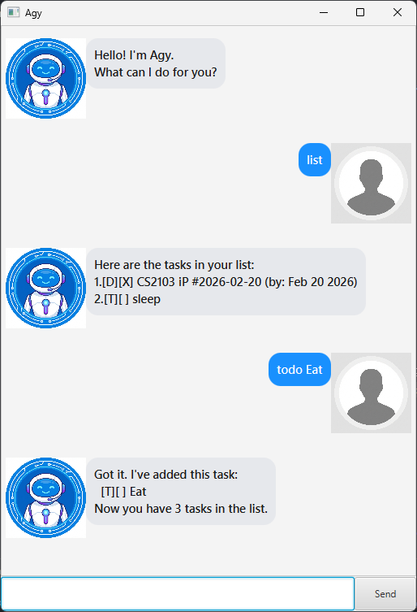

# User Guide

Agy is a desktop app for managing tasks, optimized for use via a Command Line Interface (CLI) while still having the benefits of a Graphical User Interface (GUI). If you can type fast, Agy can get your task management tasks done faster than traditional GUI apps.

## Quick Start

1. Ensure you have Java `17` or above installed in your Computer.
2. Download the latest `ip.jar` from [here](https://github.com/icypetal/ip/releases).
3. Copy the file to the folder you want to use as the _home folder_ for your Agy.
4. Open a command terminal, `cd` into the folder you put the jar file in, and use the `java -jar ip.jar` command to run the application. 
   A GUI similar to the below should appear in a few seconds.
   

5. Type the command in the command box and press Enter to execute it. e.g. typing `help` and pressing Enter will open the help window. 
   Some example commands you can try:

   * **`list`** : Lists all tasks.
   * **`todo read book`** : Adds a todo task with the description `read book`.
   * **`deadline return book /by 2024-12-12`** : Adds a deadline task with the description `return book` by `2024-12-12`.
   * **`delete 1`** : Deletes the 1st task shown in the current list.
   * **`bye`** : Exits the app.

6. Refer to the [Features](#features) below for details of each command.

## Features 

### Adding a todo task: `todo`

Adds a task without any date/time attached to it.

Format: `todo <description>`

* Adds a todo task with the specified description.
* The description cannot be empty.

Example:
* `todo read book`

### Adding a deadline task: `deadline`

Adds a task that needs to be done before a specific date/time.

Format: `deadline <description> /by <date>`

* Adds a deadline task with the specified description and date.
* The date should be in the format `yyyy-mm-dd`.

Example:
* `deadline return book /by 2024-12-12`

### Adding an event task: `event`

Adds a task that starts at a specific time and ends at a specific time.

Format: `event <description> /from <start> /to <end>`

* Adds an event task with the specified description, start time, and end time.

Example:
* `event project meeting /from Mon 2pm /to 4pm`

### Listing all tasks: `list`

Shows a list of all tasks in the task list.

Format: `list`

### Marking a task as done: `mark`

Marks a task as done.

Format: `mark <index>`

* Marks the task at the specified index as done.
* The index refers to the index number shown in the displayed task list.
* The index must be a positive integer 1, 2, 3, ...

Example:
* `mark 1`

### Marking a task as not done: `unmark`

Marks a task as not done.

Format: `unmark <index>`

* Marks the task at the specified index as not done.
* The index refers to the index number shown in the displayed task list.
* The index must be a positive integer 1, 2, 3, ...

Example:
* `unmark 1`

### Deleting a task: `delete`

Deletes the specified task from the task list.

Format: `delete <index>`

* Deletes the task at the specified index.
* The index refers to the index number shown in the displayed task list.
* The index must be a positive integer 1, 2, 3, ...

Example:
* `delete 1`

### Finding tasks by keyword: `find`

Finds tasks whose names contain the given keyword.

Format: `find <keyword>`

* The search is case-sensitive.
* The order of the keywords does not matter.
* Only the task description is searched.
* Substrings will be matched.

Example:
* `find book` returns `read book` and `return book`

### Tagging a task: `tag`

Adds a tag to a task.

Format: `tag <index> <tagname>`

* Adds the specified tag (prefixed with #) to the task at the specified index.
* The index refers to the index number shown in the displayed task list.

Example:
* `tag 1 fun` adds `#fun` to the first task.

### Exiting the program: `bye`

Exits the program.

Format: `bye`

## Command Summary

| Action | Format, Examples |
| :--- | :--- |
| **Add Todo** | `todo <description>`   e.g., `todo read book` |
| **Add Deadline** | `deadline <description> /by <date>`   e.g., `deadline return book /by 2024-12-12` |
| **Add Event** | `event <description> /from <start> /to <end>`   e.g., `event meeting /from 2pm /to 4pm` |
| **List** | `list` |
| **Mark Done** | `mark <index>`   e.g., `mark 1` |
| **Mark Undone** | `unmark <index>`   e.g., `unmark 1` |
| **Delete** | `delete <index>`   e.g., `delete 1` |
| **Find** | `find <keyword>`   e.g., `find book` |
| **Tag** | `tag <index> <tagname>`   e.g., `tag 1 fun` |
| **Bye** | `bye` |